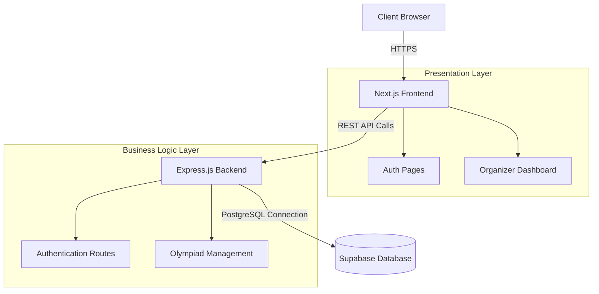

# System Design

## High-Level Architecture

## Architectural Separation (Non-Monolithic Verification)

This project strictly adheres to a non-monolithic architectural requirement. Next.js is used exclusively for the front-end presentation layer, responsible only for serving the user interface and optimizing client-side performance. All core business logic, data processing, and external integrations are handled entirely by a decoupled, hand-written Express.js API. The front-end and back-end environments are fundamentally separated, communicating strictly via standard HTTP/REST endpoints. This design ensures a true separation of concerns, preventing the coupling of presentation code with backend business logic and fulfilling the rigorous constraints of the university rubric.
