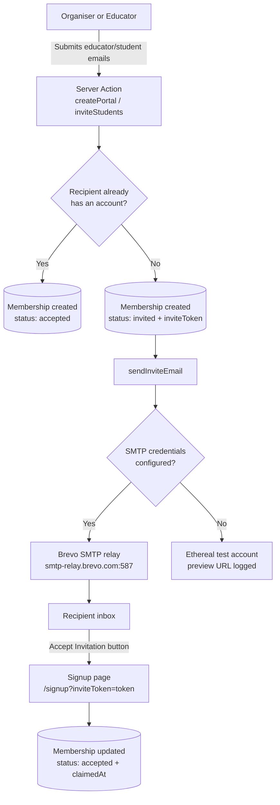

# Email (SMTP)

## Overview

The Olympiad Portal sends transactional email over SMTP, relayed through **Brevo** (formerly Sendinblue). Brevo was selected because its free tier provides 300 emails per day, which comfortably covers our invitation-driven workflows, and it exposes a standard SMTP relay that works with [Nodemailer](https://nodemailer.com/) without any proprietary SDK.

The entire email pipeline is centralized in a single module, `src/lib/email/index.ts`. Application code never talks to SMTP directly: Server Actions call the module's `sendInviteEmail()` helper, and the module decides at runtime whether to deliver through Brevo or fall back to a disposable test account for development.

## How It Works

### Transporter resolution: Brevo or Ethereal

On the first send, the module builds a Nodemailer transporter and caches it for the lifetime of the server process, so a new SMTP connection is not opened for every email.

- **SMTP credentials present** (`SMTP_HOST`, `SMTP_USER` and `SMTP_PASS` all set): the transporter points at Brevo's relay (`smtp-relay.brevo.com:587`) and real emails are delivered. Port 465 connects with implicit TLS; all other ports (including the default 587) upgrade the connection via STARTTLS. Setting `SMTP_SECURE=true` forces implicit TLS regardless of port.
- **Any credential missing**: the module creates an [Ethereal](https://ethereal.email/) test account — a fake SMTP service that captures messages and returns a preview URL instead of delivering them. This keeps local development and demos fully functional without live keys; the console logs the account details and a preview link for every email sent.

### The invitation lifecycle

Invite emails are the only email type currently implemented, and they drive account claiming for both educators and students:



Step by step:

1. An organiser creates a portal with educator emails (`createPortal` in `src/app/organiser/actions.ts`), or an educator adds student emails (`inviteStudents` in `src/app/educator/actions.ts`).
2. For each email address, the Server Action checks whether a user account already exists:
   - **Existing account:** the membership is inserted immediately with status `accepted` — no email is sent.
   - **No account:** a membership is inserted with status `invited` and a randomly generated UUID `inviteToken`, and the address is queued for an invite email.
3. Once all database writes have completed (the organiser flow only sends after the Drizzle transaction commits, so a failed email can never leave half-written data), `sendInviteEmail()` is called once per invite. It renders a styled HTML email from `EMAIL_FROM` with the subject `You've been invited to join <portalName>` and an **Accept Invitation** button linking to `${NEXT_PUBLIC_BASE_URL}/signup?inviteToken=<token>`.
4. The recipient signs up through that link. The `signup` Server Action (`src/app/auth/actions.ts`) looks up the membership by token, attaches the new user to it (`userId`, `status: 'accepted'`, `claimedAt`), and redirects them straight to their dashboard.

### Error handling

Email delivery is intentionally non-blocking: each invite send is wrapped in its own `try/catch`, so one failed recipient is logged server-side and never aborts the remaining inserts or invites. The automated reminder emails go further: every send is logged in the `notification_log` table with a `sent`/`failed` status, and failed sends are retried on the next scheduler sweep.

## Automated Reminder Emails

Besides invitations, the portal actively chases schools and entrants. A **scheduler sweep** (`sweep()` in `src/domain/rounds/round-scheduler.ts`) runs every hour — invoked by Vercel Cron via `vercel.json` — and derives every round's lifecycle state from its timestamps (`scheduled → open → closed → released`, see `src/domain/rounds/round-state-machine.ts`). For each round it decides whether a reminder is due, and the **notification engine** (`src/domain/notifications/automation-engine.ts`) resolves the recipients and sends the emails through the shared `sendEmail()` helper:

| Trigger                                                                                                  | Who is emailed                                     | Content                                                                                                           |
| -------------------------------------------------------------------------------------------------------- | -------------------------------------------------- | ----------------------------------------------------------------------------------------------------------------- |
| Round opens soon (default: 7 days before)                                                                | Educators only                                     | Opening/closing times, delivery method                                                                            |
| Round closes soon (default: 3 days before; configurable down to hours, e.g. a final "1 hour left" nudge) | Educators only                                     | Closing time (as "X days" or "about N hours" left) plus the school's own submission progress ("3 of 5 submitted") |
| Submissions overdue (default: 2 days after close)                                                        | Educators of schools with missing submissions only | Which entrants' submissions never arrived                                                                         |
| Results published (organiser action, see below)                                                          | Educators **and** entrants                         | Educators get a school-level summary; each entrant who submitted gets their own score and feedback                |

The "results are out" emails are triggered primarily by the organiser: once a round has closed, the round management page shows a **Publish Results** button. Publishing stamps `rounds.results_published_at` and immediately emails both audiences. The sweep then acts as a safety net, retrying any failed sends for a bounded window (default: 14 days).

### Frequency and the hourly schedule

The sweep runs **hourly**, which is what makes hour-level reminder windows meaningful: with `REMINDER_CLOSING_WINDOW_HOURS=1`, the closing reminder goes out on the last hourly sweep before the deadline — between 0 and 60 minutes ahead. Because sends are deduplicated (see below), the higher frequency never causes duplicate emails; a reminder simply fires on the first sweep that sees the round inside its window.

:::warning Vercel Hobby plan

Vercel's Hobby tier only allows cron jobs to run **once per day**. If your deployment fails or the cron is rejected with the hourly schedule, either upgrade to Pro, or run the sweep from any external scheduler (system cron, GitHub Actions, …) with `curl -H "Authorization: Bearer $CRON_SECRET" https://<your-app>/api/webhooks/round-scheduler` — on a once-daily schedule, hour-level windows degrade gracefully: the reminder fires on that day's single sweep if the round is inside its window at that moment.

:::

### Idempotency

Every automated email is deduplicated per `(kind, round, recipient)` by the unique constraint on `notification_log`, so running the sweep repeatedly — hourly cron, manual triggers, overlapping invocations — never double-sends. A failed send is retried on the next sweep; a successful one is never repeated.

### Manual triggering

The sweep can be run out of band for testing:

```bash
# With CRON_SECRET set (production):
curl -X POST https://olympiad-portal-eta.vercel.app/api/webhooks/round-scheduler \
  -H "Authorization: Bearer $CRON_SECRET"

# Locally (endpoint is open while CRON_SECRET is unset):
curl http://localhost:3000/api/webhooks/round-scheduler
```

The response is a JSON report of what was sent, skipped and failed per round.

## Environment Variables

All email configuration lives in `.env.local` (never commit real keys):

| Variable               | Required    | Description                                                                                                                                                                                                       |
| ---------------------- | ----------- | ----------------------------------------------------------------------------------------------------------------------------------------------------------------------------------------------------------------- |
| `SMTP_HOST`            | Yes         | SMTP relay hostname. For Brevo: `smtp-relay.brevo.com`.                                                                                                                                                           |
| `SMTP_PORT`            | No          | Defaults to `587` (STARTTLS). Use `465` for implicit TLS.                                                                                                                                                         |
| `SMTP_USER`            | Yes         | The SMTP **Login** value from the Brevo dashboard, e.g. `xxxxxxxx@smtp-brevo.com`.                                                                                                                                |
| `SMTP_PASS`            | Yes         | A generated Brevo **SMTP key** (`xsmtpsib-...`) — not your Brevo account password.                                                                                                                                |
| `SMTP_SECURE`          | No          | Set to `true` to force implicit TLS on any port.                                                                                                                                                                  |
| `EMAIL_FROM`           | Recommended | Sender address shown to recipients. Must be your Brevo account email or a sender/domain verified in Brevo, otherwise sends are rejected. A display name is supported, e.g. `"Olympiad Portal" <you@example.com>`. |
| `NEXT_PUBLIC_BASE_URL` | Recommended | Absolute base URL of the deployment, used to build the invitation links (trailing slashes are stripped automatically).                                                                                            |

:::note

The reminder-specific variables below tune the automated sweep. "Required" for the first six means required for live delivery; without `SMTP_HOST` / `SMTP_USER` / `SMTP_PASS` the app still works — all emails simply fall back to Ethereal and are not actually sent.

| Variable                        | Required   | Description                                                                                                                                             |
| ------------------------------- | ---------- | ------------------------------------------------------------------------------------------------------------------------------------------------------- |
| `CRON_SECRET`                   | Production | Bearer token required to invoke `/api/webhooks/round-scheduler`. Vercel Cron supplies it automatically; leave unset locally to keep it open.            |
| `REMINDER_OPENING_WINDOW_DAYS`  | No         | Days before `opensAt` that the opening reminder goes out (default `7`).                                                                                 |
| `REMINDER_OPENING_WINDOW_HOURS` | No         | Extra hours added to `REMINDER_OPENING_WINDOW_DAYS` (default `0`) — e.g. `days=0, hours=2` sends the opening reminder 2 hours before the round opens.   |
| `REMINDER_CLOSING_WINDOW_DAYS`  | No         | Days before `closesAt` that the closing reminder goes out (default `3`).                                                                                |
| `REMINDER_CLOSING_WINDOW_HOURS` | No         | Extra hours added to `REMINDER_CLOSING_WINDOW_DAYS` (default `0`) — e.g. `days=0, hours=1` turns the closing reminder into a final "1 hour left" nudge. |
| `REMINDER_OVERDUE_AFTER_DAYS`   | No         | Days after `closesAt` that the overdue follow-up goes out (default `2`).                                                                                |
| `REMINDER_RESULTS_CATCHUP_DAYS` | No         | How long the sweep retries failed "results are out" sends after publication (default `14`).                                                             |

:::

## Brevo Setup Guide

1. Create a free account at [brevo.com](https://www.brevo.com) (free tier: 300 emails/day).
2. Open the SMTP & API settings page: [app.brevo.com/settings/keys/smtp](https://app.brevo.com/settings/keys/smtp).
3. Copy the **Login** value (it looks like `xxxxxxxx@smtp-brevo.com`) into `SMTP_USER`.
4. Click **Generate a new SMTP key** and paste it into `SMTP_PASS`.
5. Set `EMAIL_FROM` to your Brevo account email, or verify a custom sender/domain in Brevo and use that address.
6. Add the values to `.env.local` and restart the dev server.

```bash
# Email sending — Brevo SMTP (placeholders, do not commit real keys)
SMTP_HOST=smtp-relay.brevo.com
SMTP_PORT=587
SMTP_USER=xxxxxxxx@smtp-brevo.com
SMTP_PASS=xsmtpsib-xxxxxxxxxxxxxxxxxxxxxxxx
EMAIL_FROM="Olympiad Portal" <you@example.com>
NEXT_PUBLIC_BASE_URL=http://localhost:3000
```

### Gotchas

- **Unverified senders are rejected.** If `EMAIL_FROM` is missing, the module logs a warning and falls back to a placeholder address (`noreply@olympiad-portal.local`) that Brevo will refuse.
- **Daily quota.** The Brevo free tier allows 300 emails per day; a large portal-creation batch or a results release can approach this limit. The reminder sweep caps sends at one email per recipient per reminder kind per round.
- **Ethereal is silent.** While credentials are absent, everything appears to work — watch the server console for the `Email preview:` URLs to inspect the captured messages.
- **Reminder emails are logged and retried.** Failures are recorded in `notification_log` with `status='failed'` and retried on the next hourly sweep; invitations remain fire-and-log.
